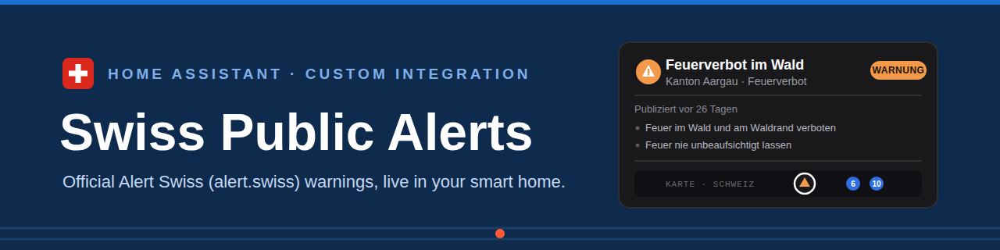
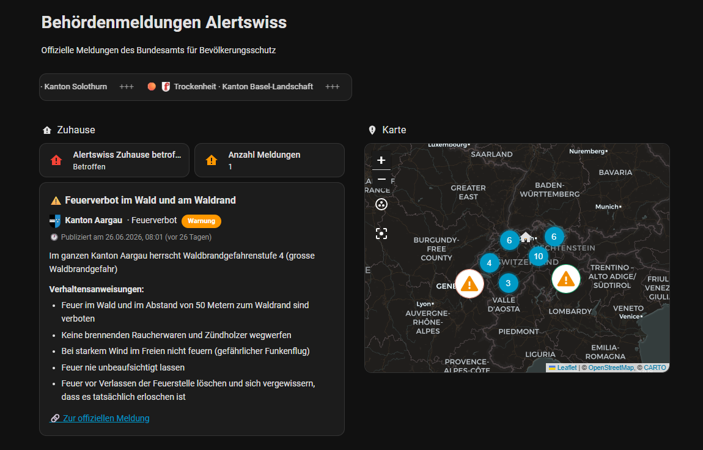

# Swiss Public Alerts (Alertswiss)



[](https://github.com/hacs/integration)
[](LICENSE)
<a href="https://www.buymeacoffee.com/prusuino"></a>

A Home Assistant custom integration for the official Swiss public alerts from **Alertswiss**, the alerting platform of the **Federal Office for Civil Protection (FOCP/BABS)** and the cantons: fire bans, natural hazards, drinking-water contamination, evacuation orders, siren tests, and other official alerts.

## Background

Alertswiss publishes every alert with the **exact polygon of the affected area**. This integration uses that to answer the one question that matters: **is my home affected?** Instead of a simple radius check, your Home Assistant home location is tested against the official area polygons (point-in-polygon), so a "whole canton of X" alert matches if — and only if — you live there.

## What it provides

| Entity | Description |
|---|---|
| `binary_sensor` **Home location affected** | `on` when at least one active alert area covers your home. Attributes carry the full alert: title, description, official **behaviour instructions**, publisher, severity, published time, link — everything an automation needs to send a useful notification. All matching alerts are included in an `alerts` attribute |
| `sensor` **Active alerts Switzerland** | Number of active alerts nationwide, with per-alert summaries (canton code, severity, published time, distance from home) as attributes |
| `sensor` **Alerts for home location** | Number of active alerts covering your home |
| `sensor` **Feed heartbeat age** | Diagnostic: age of the Alertswiss feed heartbeat |
| `geo_location.*` | One map marker per alert with an Alertswiss-style severity symbol (red diamond / orange triangle / blue circle). Hidden from auto-generated maps — they appear only on map cards that reference the `swiss_public_alerts` source explicitly |

Entity IDs follow your Home Assistant language; test alerts and all-clear messages are filtered out.

## Bundled dashboard & cards



The integration automatically creates an **"Alerts" dashboard** on first setup (and removes it again if you remove the integration — your own edits to it are never overwritten). It also registers three Lovelace cards, all with a **visual editor** and available in the normal card picker for use on any dashboard:

| Card | Description |
|---|---|
| **Alertswiss Ticker** (`custom:alertswiss-ticker-card`) | A scrolling news-ticker line of the active alerts: severity symbol, cantonal coat of arms, event and publisher |
| **Alertswiss Alert** (`custom:alertswiss-alert-card`) | Full detail view of the alert affecting your home — description, behaviour instructions, official link. If several alerts affect your home, page through them with ‹ › |
| **Alertswiss List** (`custom:alertswiss-list-card`) | A compact, filterable list of alerts with coat of arms, severity dot, published time and distance |

Ticker and list can be **filtered** in the visual editor: by canton(s), by maximum distance from home, and by minimum severity. Nationwide alerts always pass the filters.

## Language

Config flow, entity names, and the bundled cards follow your Home Assistant language — German, English, French, and Italian are supported, with English as the fallback.

## Installation

### HACS (recommended)

1. In HACS, go to **Integrations → ⋮ → Custom repositories**, add this repository URL with category **Integration**.
2. Search for **"Swiss Public Alerts"** and install.
3. Restart Home Assistant.

### Manual

1. Copy the `custom_components/swiss_public_alerts` folder into your Home Assistant `config/custom_components/` directory.
2. Restart Home Assistant.

## Setup

1. Go to **Settings → Devices & Services → Add Integration**.
2. Search for **"Swiss Public Alerts"**.
3. Choose the feed language, the minimum severity to track (information / warning / alarm), and the update interval.
4. Done — the entities, the map markers, and the "Alerts" dashboard appear automatically.

All options can be changed later via the integration's **Configure** button without re-adding it.

## Example automation

The binary sensor is designed for notifications — the alert text and the official behaviour instructions are right there in its attributes:

```yaml
triggers:
  - trigger: state
    entity_id: binary_sensor.alertswiss_home_location_affected
    to: "on"
actions:
  - action: notify.mobile_app_your_phone
    data:
      title: "⚠️ {{ state_attr('binary_sensor.alertswiss_home_location_affected', 'title') }}"
      message: >-
        {{ state_attr('binary_sensor.alertswiss_home_location_affected', 'publisher') }}:
        {{ state_attr('binary_sensor.alertswiss_home_location_affected', 'description') }}
```

## Data source & license

This integration reads the publicly published Alertswiss feed. That content is copyright of the Swiss federal authorities and licensed under **[CC BY-NC-SA 2.5](https://creativecommons.org/licenses/by-nc-sa/2.5/)** — free-of-charge, non-commercial use with the required source reference **"Quelle: www.alertswiss.ch"**, which every entity of this integration carries as its `attribution` attribute. See [NOTICE.md](NOTICE.md) for details, including the provenance of the bundled cantonal coats of arms.

## Notes

- The feed endpoint is the one the Alertswiss website itself uses; it is not a formally documented API and may change without notice. If it becomes unreachable or changes, entities become `unavailable` rather than reporting stale data.
- Alert areas without polygons (rare) cannot be matched against your home; nationwide alerts always match.
- This integration is unofficial and not affiliated with, endorsed by, or supported by the FOCP/BABS or Alertswiss.
- **This is informational only.** For official alerting, use the [Alertswiss app](https://www.alert.swiss/) with its push notifications — it is the authoritative channel, works when your smart home does not, and covers you when you are away from home.

## Disclaimer

This integration is provided **as-is, without any warranty**. Data is retrieved from a third-party published source and may be inaccurate, delayed, incomplete, or unavailable. **Never rely on this integration as your sole source for safety-critical decisions or emergency alerting** — install the official Alertswiss app and follow the instructions of the authorities. The author(s) accept **no responsibility or liability** for any damage, injury, loss, missed or incorrect alerts, or other issues arising from using this integration, whether it stops working, behaves unexpectedly, or never worked correctly for your setup in the first place.

## License

Source code: MIT — see [LICENSE](LICENSE). Alert data: CC BY-NC-SA 2.5 (Swiss federal authorities) — see [NOTICE.md](NOTICE.md).

## Related integrations

More Home Assistant integrations from the same author:

- [Swiss Charging Stations](https://github.com/prusuino/ha_swiss_charging_stations) — real-time availability and prices of public EV charging stations in Switzerland
- [Austrian Charging Stations](https://github.com/prusuino/ha_austrian_charging_stations) — real-time availability of public EV charging stations in Austria
- [Swiss Transport](https://github.com/prusuino/ha_swiss_transport) — live public-transport departure boards and saved connections
- [Swiss Parking](https://github.com/prusuino/ha_swiss_parking) — live free parking spaces in Swiss cities
- [Swiss Electricity Price](https://github.com/prusuino/ha_swiss_electricity_price) — electricity tariffs of any Swiss grid operator (ElCom)
- [Swiss Solar Reference Price](https://github.com/prusuino/ha_swiss_solar_reference_price) — the Swiss solar reference market price (SFOE)
- [Swiss Earthquakes](https://github.com/prusuino/ha_swiss_earthquakes) — recent Swiss earthquakes on the built-in map
- [Swiss Avalanche Bulletin](https://github.com/prusuino/ha_swiss_avalanche_bulletin) — the official SLF avalanche bulletin for your location
- [Innoxel Master 3](https://github.com/prusuino/ha_innoxel_master3) — local control of the Innoxel Master 3 home-automation system

## Support

If this integration is useful to you, you can support its development:

<a href="https://www.buymeacoffee.com/prusuino"></a>
